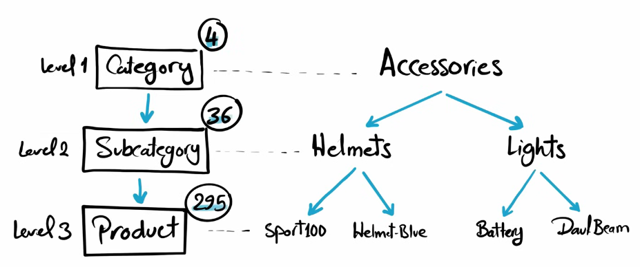

# 📊 SQL_Project_Analysis_data_warehouse


## 📝 Project Objective

The objective of this project is to do an Exploratory Data Analysis (EDA) to the information of a Data Warehouseby project previously worked on - https://github.com/Daumas117/SQL_Project_data_warehouse -.

## 🏗️ Data Architecture


## **Database Exploration**

```sql
-- Database Exploration

select
	TABLE_CATALOG,
	TABLE_SCHEMA,
	TABLE_NAME,
	TABLE_TYPE
from INFORMATION_SCHEMA.tables; -- Retrieve a  list of all tables in the DB.
```
 

We will be working with the following views:

- gold.dim_customers
- gold.dim_products
- gold.fact_sales


## **Dimension Exploration**

```sql
SELECT DISTINCT
	category,
	subcategory,
	product_name
FROM gold.dim_products
ORDER BY category, subcategory, product_name
```


With this information, we can assume that we will be working with the following format of information.



## **Data Exploration**

```sql
-- Find the Total Sales

SELECT sum(sales_amount) as total_sales
FROM gold.fact_sales

-- Find how many items are sold.

SELECT sum(quantity) as total_items_sold
FROM gold.fact_sales

-- Find the average selling price

SELECT avg(price) as avg_price
FROM gold.fact_sales

-- Find the Total number of Orders

SELECT count(order_number) as total_number_orders
FROM gold.fact_sales
SELECT DISTINCT count(order_number) as total_number_orders
FROM gold.fact_sales

-- Find the total number of products
SELECT count(product_name) as total_product
FROM gold.dim_products

-- Find the total number of customers
SELECT count(customer_id) as total_number_customers
FROM gold.dim_customers

-- Find the total number of customers that has placed an order
SELECT count(DISTINCT customer_key) AS total_customers 
FROM gold.fact_sales;
```


With this information, we can create a report. We can have the information spread out, but we can summarize everything in a unique query.

```sql

-- Generate a Report that shows all key metrics of the business
SELECT 'Total Sales' as measure_name, sum(sales_amount) as measure_value FROM gold.fact_sales
UNION ALL 
SELECT 'Total Quantity' as measure_name, sum(quantity) as measure_value FROM gold.fact_sales
UNION ALL
SELECT 'Average Price', AVG(price) FROM gold.fact_sales
UNION ALL
SELECT 'Total Orders', COUNT(DISTINCT order_number) FROM gold.fact_sales
UNION ALL
SELECT 'Total Products', COUNT(DISTINCT product_name) FROM gold.dim_products
UNION ALL
SELECT 'Total Customers', COUNT(customer_key) FROM gold.dim_customers;
```


```sql
-- Find total customers by countries

SELECT 
	country, count(customer_key) as total_customers
FROM gold.dim_customers
group by country
order by total_customers desc

-- Find total customers by gender

SELECT 
	gender,
	count(gender) as total_by_gender
FROM gold.dim_customers
group by gender
order by total_by_gender desc

-- Find total products by category

SELECT 
	category,
	count(product_name) as total_product_by_category
FROM gold.dim_products
group by category
ORDER BY total_product_by_category desc
```


```sql
-- What is the average costs in each category?

SELECT
	category,
	avg(cost) as avg_cost_per_categroy
FROM gold.dim_products
GROUP BY category
ORDER BY avg_cost_per_categroy desc

-- What is the total revenue generated for each category?

SELECT
	pr.category,
	sum(fs.sales_amount) as total_revenue
FROM gold.fact_sales fs
left join gold.dim_products pr
	on fs.product_key = pr.product_key
group by pr.category
order by total_revenue desc

-- What is the total revenue generated by each customer?

SELECT
	cs.customer_id,
	cs.first_name,
	cs.last_name,
	sum(fs.sales_amount) as total_revenue
FROM gold.fact_sales fs
left join gold.dim_customers cs
	on fs.customer_key = cs.customer_key
group by 
	cs.customer_id,
	cs.first_name,
	cs.last_name
order by total_revenue desc
```


```sql
-- What are the 5 worst-performing products in terms of sales?

SELECT TOP 5 
	p.product_name as product_name,
	sum(f.sales_amount) as total_revenue
FROM gold.fact_sales f
LEFT JOIN gold.dim_products p
on f.product_key = p.product_key
group by product_name
order by total_revenue asc

select *
from (
	SELECT 
		p.product_name as product_name,
		sum(f.sales_amount) as total_revenue,
		row_number() over (order by sum(f.sales_amount) desc) as rank_products
	FROM gold.fact_sales f
	LEFT JOIN gold.dim_products p
	on f.product_key = p.product_key
	group by product_name
)t
where rank_products <= 5
```


```sql
SELECT TOP 10
	c.customer_id,
	c.first_name,
	sum(f.sales_amount) as total_revenue
FROM gold.fact_sales f
LEFT JOIN gold.dim_customers c
on f.customer_key = c.customer_key
group by 
	c.customer_id,
	c.first_name
order by total_revenue desc

-- The 3 customers with the fewest orders placed

SELECT TOP 3
	c.customer_key,
	c.first_name,
	c.last_name,
	count(distinct f.order_number) as total_orders
FROM gold.fact_sales f
LEFT JOIN gold.dim_customers c
on c.customer_key = f.customer_key
group by 
	c.customer_key,
	c.first_name,
	c.last_name
order by total_orders
```


